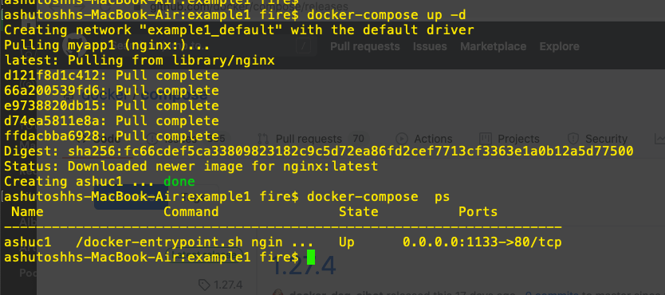

# Here are just introducting how to use a compose file to start 
## with Nginx container 

## Rules 

<ol>
<li> choose / create an empty directory  </li>
<li> create a file called docker-compose.yml or docker-compose.yaml  </li>
<li> file name can be any thing but default choice is docker-compsoe.yml </li>
<li> Here we are choosing compose file version 3.8 that is also supporting stack </li>
</ol>

## Run this file like this 


```
docker-compose up -d
```

